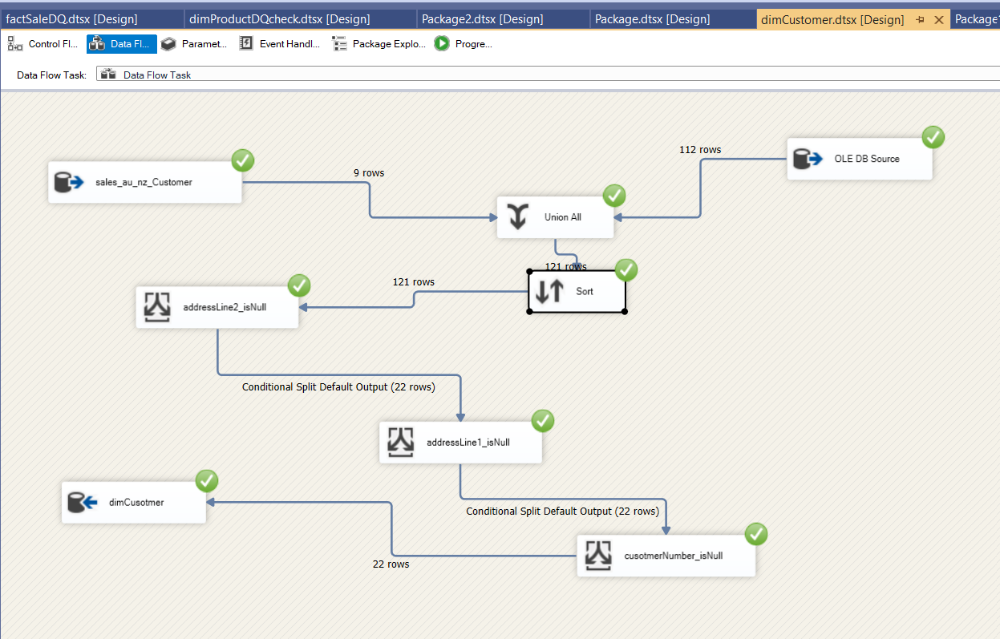
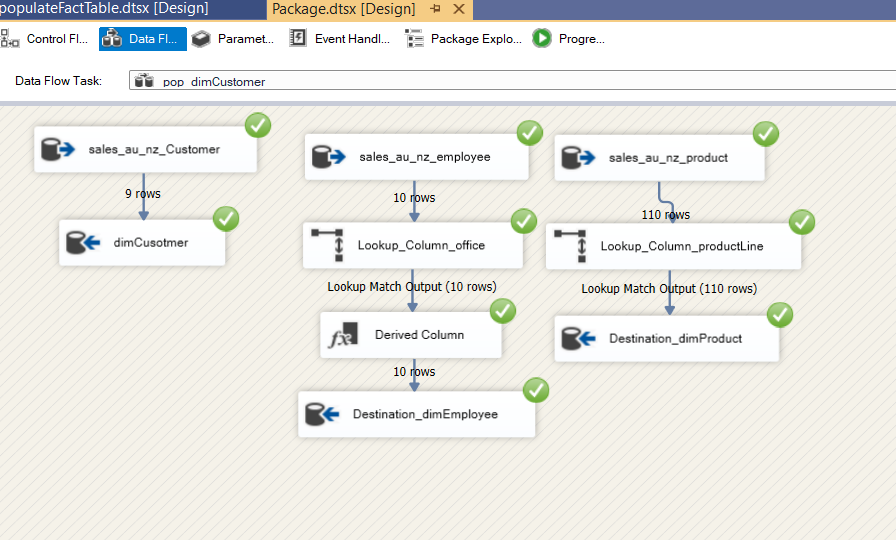

# Northwind Data Warehouse Integration

This repository contains the SSIS project and resources for integrating data from two OLTP Northwind databases into a data warehouse.

## Introduction
The purpose of this project is to integrate data from two OLTP Northwind databases into a centralized data warehouse. This data warehouse facilitates advanced analytics and reporting. Additionally, we have created space for storing and managing photos related to the products and employees.

## Features
- **Data Integration**: Extract, Transform, and Load (ETL) processes for integrating data from two Northwind databases.
- **Data Warehouse**: Centralized data repository designed for efficient querying and analysis.
- **Scalable Architecture**: Designed to handle increasing data volumes and complexity.
- **Comprehensive Documentation**: Detailed instructions and explanations for setup and usage.

## Architecture
The architecture consists of the following components:
1. **Source OLTP Databases**: Two Northwind databases serving as the source.
2. **ETL Processes**: Scripts to extract data from OLTP databases, transform it, and load it into the data warehouse.
3. **Data Warehouse**: Centralized database designed for analytics, with star schema and dimensions.

)

